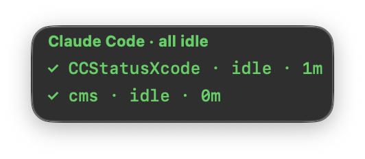
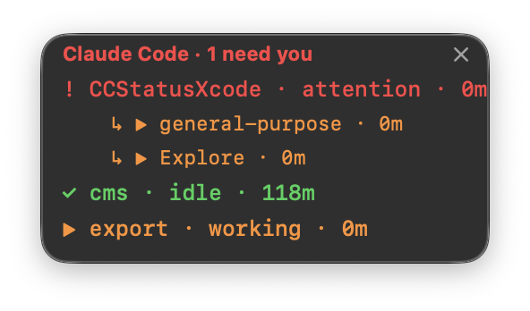

# CC Status (Xcode project)

A tiny always-on-top macOS window showing the live status of every
Claude Code session across all your VSCode windows.

- ▶ orange — Claude is working
- ! red — a session needs your input (permission prompt / question)
- ✓ green — finished, waiting for you

Running **subagents** appear as indented rows (`↳ Explore`, `↳ general-purpose`, …)
beneath their project, and the project row rolls up to the most urgent state of
itself and its agents. Subagent rows disappear the moment the subagent finishes.

Click a project row to jump to that workspace in VSCode.
Drag anywhere to move (position is remembered).
Right-click for: Launch at Login · Open State Folder · Quit.
There's also a small **×** in the top-right corner to quit.
No Dock icon — it's a floating widget visible on every Space,
including over fullscreen apps.

## Screenshots

| All idle | Needs attention + subagents |
|---|---|
|  |  |

---

# Setup

There are only **two required steps**. Everything under "Optional" can be skipped.

## Required step 1 — Get the app

Pick **one** of these. You do **not** need to do both.

### Option A — Download (easiest, no Xcode)

1. Download **[`dist/CCStatus-v1.0.zip`](dist/CCStatus-v1.0.zip)**
   (universal app, Intel + Apple Silicon, macOS 13+).
2. Unzip it and move **CC Status.app** into your `/Applications` folder.
3. First launch — get past Gatekeeper (only needed **once**):
   - **Right-click** the app → **Open** → click **Open** in the dialog.
   - On macOS 15 (Sequoia) you'll likely see *"Apple could not verify
     'CC Status.app' is free of malware…"* and **no Open button**. Instead open
     **System Settings → Privacy & Security**, scroll down to the
     *"CC Status.app was blocked"* notice, and click **Open Anyway**.
   - Still stuck? Strip the quarantine flag in Terminal, then open it:
     ```bash
     xattr -dr com.apple.quarantine "/Applications/CC Status.app"
     open "/Applications/CC Status.app"
     ```
   - This is needed because the app is signed to run locally but **not
     notarized** (notarization requires a paid Apple Developer account) — not
     because anything is wrong with it.

### Option B — Build from source (needs Xcode)

1. Open `CCStatus.xcodeproj` in Xcode.
2. Press ⌘R — the floating panel appears.
3. To keep it permanently: Product → Build (Release), then
   Product → Show Build Folder in Finder, and copy `CC Status.app` to `/Applications`.

Signing is preset to "Sign to Run Locally" (no Apple Developer account needed).
If Xcode asks for a team: target **CC Status** → Signing & Capabilities →
Team: None / Sign to Run Locally.

## Required step 2 — Install the Claude Code hooks

**Without this, the window stays empty.** The app only *displays* status; these
hooks are what *write* it (to `~/.claude/cc-status/`). Do this once:

1. `mkdir -p ~/.claude/hooks`
2. Copy `hooks/cc-status-hook.sh` to `~/.claude/hooks/` and
   `chmod +x ~/.claude/hooks/cc-status-hook.sh`
3. Merge the `"hooks"` block from `hooks/settings-hooks-snippet.json`
   into `~/.claude/settings.json`
4. Restart your Claude Code sessions (hooks load at session start)

**That's it — the widget now shows live status.**

> **Updating from an older version?** The hook script and the `"hooks"` block
> change between releases (e.g. subagent tracking added the `SubagentStart` /
> `SubagentStop` events). Re-copy `hooks/cc-status-hook.sh` to `~/.claude/hooks/`,
> re-merge the latest `"hooks"` block into `~/.claude/settings.json`, then restart
> your Claude Code sessions — otherwise new features stay inactive.

---

# Optional

### Launch at login
Right-click the floating window → **Launch at Login**.
(Works most reliably once the app is in `/Applications`.)

### Customize (edit Swift, then rebuild with ⌘R)
- Poll interval: `Timer.scheduledTimer(withTimeInterval: 2.0, ...)` in AppDelegate.swift
- Colors / symbols: `stateColor()` / `stateSymbol()` in SessionStore.swift
- Stale-session cutoff (default 6h): `staleSeconds` in SessionStore.swift
- Stale-subagent cutoff (default 5m): `agentStaleSeconds` in SessionStore.swift
- Transparency: `withAlphaComponent(0.92)` in AppDelegate.swift
- Window size minimum: `size.width = max(size.width, 220)` in AppDelegate.swift

---

# For developers

## Project structure

```
CCStatusXcode/
├── CCStatus.xcodeproj         ← open this in Xcode
├── CCStatus/
│   ├── main.swift             entry point (accessory app, no Dock icon)
│   ├── AppDelegate.swift      floating NSPanel, refresh loop, × quit, context menu
│   ├── SessionStore.swift     reads ~/.claude/cc-status/*.json, prunes stale files
│   ├── SessionGrouping.swift  pure logic: groups files into a project→agents tree
│   └── RowLabel.swift         clickable session row
├── hooks/                     Claude Code hook setup (see Required step 2)
├── Tests/main.swift           standalone `swiftc` test for SessionGrouping
└── dist/                      prebuilt downloadable zips
```

## Rebuild the distributable zip (for a new version)

Produces a new `dist/CCStatus-vX.Y.zip` others can download and run without
Xcode (no Apple Developer account needed). Run from the repo root:

```bash
# 1. (Optional) bump MARKETING_VERSION in CCStatus.xcodeproj

# 2. Build a universal (Intel + Apple Silicon) Release build
rm -rf build
xcodebuild -project CCStatus.xcodeproj -scheme "CC Status" -configuration Release \
  -derivedDataPath build CONFIGURATION_BUILD_DIR=build/export \
  ARCHS="arm64 x86_64" ONLY_ACTIVE_ARCH=NO clean build

# 3. Zip the .app (use ditto, NOT Finder's compress — it preserves the bundle)
ditto -c -k --keepParent "build/export/CC Status.app" "dist/CCStatus-v1.0.zip"
```

Verify before publishing:

```bash
lipo -info "build/export/CC Status.app/Contents/MacOS/CC Status"   # → x86_64 arm64
codesign -dv "build/export/CC Status.app"                          # → ad-hoc signed
```

The `build/` folder is throwaway (git-ignored); commit only the new
`dist/CCStatus-vX.Y.zip`. You can also attach the zip to a **GitHub Release**.

## Run the tests

No XCTest target — tests are standalone and runnable from the repo root:

```bash
# Grouping logic (project→agents tree, rollup, stale/dedup rules)
swiftc CCStatus/SessionGrouping.swift Tests/main.swift -o /tmp/sgtest && /tmp/sgtest

# Hook script (per-session vs per-agent files, removal cascades)
./hooks/test-cc-status-hook.sh
```

Both print `ALL PASS`.

## Notes

- Do **not** enable App Sandbox if you add capabilities later — the app needs to
  read `~/.claude/cc-status/` and launch VSCode, which the sandbox blocks.
- `Info.plist` is generated by Xcode (GENERATE_INFOPLIST_FILE = YES);
  the no-Dock-icon behavior comes from the INFOPLIST_KEY_LSUIElement build setting.
